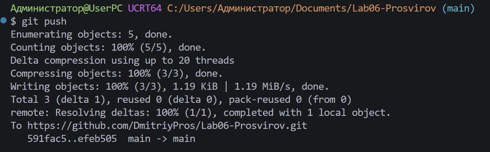

# Практическая работа №6
**ФИО: Просвиров Дмитрий Анатольевич**
**Группа: ИСП-241**
**Дата: 08.10.2026**
## Что изучено:
* Синтаксис и основные принципы работы работы циклов `for`, `while`, `do while`
* Главные отличия `while` от `do while`:
    1. while (с предусловием): Сначала проверяется условие, и только потом выполняется код. Если условие изначально ложно — цикл не выполнится ни разу.
    2. do while (с постусловием): Сначала выполняется код, и только потом проверяется условие. Тело цикла гарантированно выполнится как минимум один раз, даже если условие изначально ложно.
* Использование `continue`, `break`, условия `if`/`else` внутри циклов
***

***

